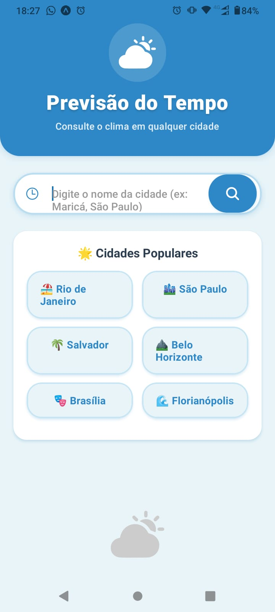
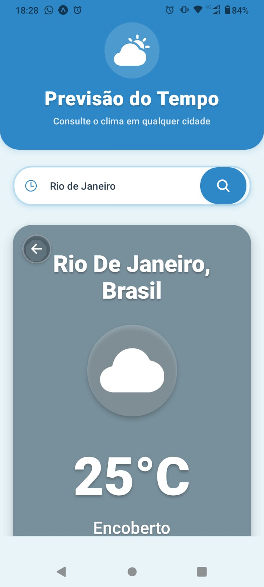
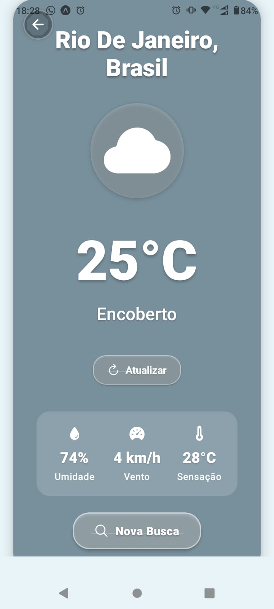

# 🌤️ App de Previsão do Tempo

<div align="center">
  
  
  
  
  
  <br/>
  
  **Aplicativo móvel simples e elegante para consultar a previsão do tempo de qualquer cidade do mundo**
  
  🌍 *Desenvolvido com React Native e Expo* 🌍
  
</div>

---

## 📸 Screenshots

<div align="center">
  
  ### 🎨 Demonstração Visual do App
  
  
  
  
  
  <br/>
  
  | 🏠 Tela Inicial | ☁️ Resultado com Clima | ❌ Feedback de Erro |
  |:---:|:---:|:---:|
  | Campo de busca com sugestões de cidades populares brasileiras | Card colorido mostrando temperatura, umidade, vento e sensação térmica | Mensagem amigável quando a cidade não é encontrada |
  
</div>

### 🎨 Principais Telas

| Tela Inicial | Sugestões de Cidades | Resultado - Niterói |
|:---:|:---:|:---:|
| Interface limpa com campo de busca e sugestões de cidades populares | Histórico de buscas recentes para acesso rápido | Card colorido mostrando temperatura e detalhes do clima |

| Resultado - São Paulo | Histórico de Buscas | Tela de Erro |
|:---:|:---:|:---:|
| Cores dinâmicas que mudam conforme o clima | Últimas 5 cidades pesquisadas salvas | Feedback amigável quando a cidade não é encontrada |

> 💡 **Dica**: As cores do card mudam automaticamente baseado nas condições climáticas!
> - ☀️ Laranja para céu limpo
> - ☁️ Cinza azulado para nublado  
> - 🌧️ Azul índigo para chuva
> - ⛈️ Cinza escuro para tempestades

## 📱 Funcionalidades

### Core Features ⭐
- ✅ Busca de previsão do tempo por nome da cidade (com suporte a acentos!)
- ✅ Exibição de temperatura atual em Celsius
- ✅ Descrição do clima traduzida para português
- ✅ Ícones dinâmicos representando condições climáticas
- ✅ Informações adicionais: umidade, velocidade do vento e sensação térmica
- ✅ Cores de fundo que mudam conforme o clima

### Funcionalidades Extras 🎯
- ✅ **Histórico de Buscas** - Salva as 5 últimas cidades pesquisadas
- ✅ **Sugestões de Cidades** - Cidades brasileiras populares com acesso rápido
- ✅ **Botão Atualizar** - Recarrega os dados da cidade atual
- ✅ **Suporte a Caracteres Especiais** - Funciona com Maricá, São Paulo, etc.
- ✅ **Interface Premium** - Design moderno com sombras e animações
- ✅ **+30 Traduções Climáticas** - Todas as condições em português

## 🚀 Tecnologias Utilizadas

- **React Native** - Framework para desenvolvimento mobile
- **Expo** - Plataforma para facilitar o desenvolvimento
- **OpenWeatherMap API** - API pública de dados meteorológicos
- **@expo/vector-icons** - Biblioteca de ícones

## 📋 Pré-requisitos

Antes de começar, você precisa ter instalado:

- [Node.js](https://nodejs.org/) (versão 18 ou superior)
- [npm](https://www.npmjs.com/) ou [yarn](https://yarnpkg.com/)
- [Expo CLI](https://docs.expo.dev/get-started/installation/)
- Aplicativo **Expo Go** no seu dispositivo móvel ([Android](https://play.google.com/store/apps/details?id=host.exp.exponent) | [iOS](https://apps.apple.com/app/expo-go/id982107779))

## 🔑 Configuração da API (100% Gratuita!)

1. Acesse [WeatherAPI](https://www.weatherapi.com/signup.aspx)
2. Crie uma conta **gratuita** (não precisa de cartão de crédito! 🎉)
3. Após o login, copie sua **API Key** do painel
4. Abra o arquivo `App.js`
5. Substitua `'SUA_CHAVE_API_AQUI'` pela sua chave:

```javascript
const API_KEY = 'sua_chave_api_real_aqui';
```

**Plano Gratuito**: 1 milhão de chamadas por mês - mais que suficiente!

## ⚙️ Instalação

1. Clone ou baixe este repositório

2. Navegue até a pasta do projeto:
```bash
cd app-clima
```

3. Instale as dependências:
```bash
npm install
```

ou

```bash
yarn install
```

## 🎮 Como Executar

1. Inicie o servidor Expo:
```bash
npm start
```

ou

```bash
expo start
```

2. Um QR code será exibido no terminal e no navegador

3. Abra o aplicativo **Expo Go** no seu smartphone

4. Escaneie o QR code:
   - **Android**: Use o leitor de QR code do Expo Go
   - **iOS**: Use a câmera nativa do iPhone

5. O aplicativo será carregado no seu dispositivo

## 📱 Como Usar

### 🔍 Buscando uma Cidade
1. **Digite o nome** de uma cidade no campo de texto (aceita acentos!)
   - Exemplos: `Maricá`, `São Paulo`, `Niterói`, `Rio de Janeiro`
2. **Pressione o botão de busca** (ícone de lupa) ou tecla Enter
3. **Aguarde** o carregamento dos dados
4. **Visualize** as informações completas do clima

### 🎯 Atalhos Rápidos
- **Sugestões de Cidades**: Clique nas cidades populares sugeridas
- **Histórico**: Toque no ícone de relógio (⏱️) para ver buscas recentes
- **Atualizar**: Use o botão "Atualizar" dentro do card para dados mais recentes
- **Voltar**: Botão ← no canto superior ou "Nova Busca" no final do card

### 📊 Informações Exibidas
- 🏙️ Nome da cidade e país
- 🌡️ Temperatura atual em Celsius
- ☁️ Descrição do clima (traduzido)
- 💧 Umidade do ar (%)
- 💨 Velocidade do vento (km/h)
- 🔥 Sensação térmica (°C)

## 🎨 Destaques Visuais

### 🌈 Cores Dinâmicas por Clima
O app muda automaticamente as cores do card baseado nas condições climáticas:

```
☀️ Céu Limpo      → Laranja vibrante (#FFA726)
☁️ Nublado        → Cinza azulado (#78909C)
🌧️ Chuva         → Azul índigo (#5C6BC0)
💨 Garoa          → Roxo suave (#7E57C2)
⛈️ Tempestade     → Cinza escuro (#455A64)
❄️ Neve           → Azul claro (#81D4FA)
🌫️ Neblina       → Cinza névoa (#90A4AE)
```

### ✨ Elementos Visuais Modernos
- **Sombras suaves** em todos os elementos
- **Bordas arredondadas** (20-30px)
- **Ícones animados** da biblioteca Ionicons
- **Efeitos de texto** com sombras para melhor legibilidade
- **Cards translúcidos** com efeito glassmorphism
- **Gradientes sutis** no header

### 🎯 Ícones por Condição Climática

| Condição | Ícone | Descrição |
|----------|-------|-----------|
| Céu limpo | ☀️ sunny | Sol brilhante |
| Nublado | ☁️ cloudy | Nuvens |
| Chuva | 🌧️ rainy | Chuva |
| Tempestade | ⛈️ thunderstorm | Raios e trovões |
| Neve | ❄️ snow | Flocos de neve |
| Neblina | 🌫️ cloud | Nuvem de neblina |

## 📂 Estrutura do Projeto

```
app-clima/
├── App.js              # Componente principal do aplicativo (880+ linhas)
├── package.json        # Dependências e scripts
├── app.json           # Configurações do Expo
├── babel.config.js    # Configuração do Babel
├── .gitignore         # Arquivos ignorados pelo Git
└── README.md          # Documentação do projeto
```

### 📊 Estatísticas do Código
- **~880 linhas** de código bem documentado
- **30+ traduções** de condições climáticas
- **15+ estilos** personalizados
- **7 cores** dinâmicas por clima
- **6 funcionalidades** principais

## 🌐 API Utilizada

**WeatherAPI** (100% Gratuita, sem cartão!)
- Endpoint: `https://api.weatherapi.com/v1/current.json`
- Parâmetros:
  - `key`: Chave da API
  - `q`: Nome da cidade
  - `lang=pt`: Descrições em português
- **Plano Gratuito**: 1 milhão de requisições/mês
- **Sem cartão de crédito necessário!** ✨

## 🎯 Recursos Implementados

### Interface de Usuário (UI)
- ✅ Campo de entrada de texto para nome da cidade
- ✅ Botão de busca com ícone
- ✅ Área de exibição de resultados
- ✅ Indicador de carregamento (ActivityIndicator)
- ✅ Mensagens de erro amigáveis
- ✅ Design responsivo e moderno

### Consumo de API
- ✅ Requisições HTTP com fetch
- ✅ Tratamento de erros de rede
- ✅ Validação de entrada do usuário
- ✅ Processamento de resposta JSON

### Exibição de Dados
- ✅ Nome da cidade e país
- ✅ Temperatura atual em Celsius
- ✅ Descrição do clima em português
- ✅ Ícones dinâmicos baseados no clima
- ✅ Informações extras (umidade, vento, sensação térmica)
- ✅ Cores de fundo dinâmicas

## 🎨 Ícones por Condição Climática

| Condição | Ícone |
|----------|-------|
| Céu limpo | ☀️ sunny |
| Nublado | ☁️ cloudy |
| Chuva | 🌧️ rainy |
| Tempestade | ⛈️ thunderstorm |
| Neve | ❄️ snow |
| Neblina | 🌫️ cloud |

## 🔧 Possíveis Melhorias Futuras

### 🎯 Features Planejadas
- [ ] 📅 Previsão para os próximos 5-7 dias
- [ ] 📍 Localização automática via GPS
- [ ] ⭐ Sistema de favoritos para cidades
- [ ] 🌙 Modo escuro/claro com toggle
- [ ] 📊 Gráficos interativos de temperatura
- [ ] 🔔 Notificações push de alertas climáticos
- [ ] 🌍 Suporte a múltiplos idiomas
- [ ] 🎨 Temas personalizáveis
- [ ] 💾 Persistência de dados (AsyncStorage)
- [ ] 🔄 Pull-to-refresh no card de resultados

## ⚠️ Solução de Problemas

### Erro "API Key inválida"
- Verifique se você inseriu a chave correta no `App.js`
- Confirme se copiou a chave completa do painel da WeatherAPI
- A chave é ativada instantaneamente após o cadastro!

### Erro "Cidade não encontrada"
- Verifique a ortografia do nome da cidade
- Tente usar o nome em inglês
- Use nomes de cidades maiores ou mais conhecidas

### Erro de conexão
- Verifique sua conexão com a internet
- Certifique-se de que o dispositivo está na mesma rede
## 📊 Informações do Projeto

<div align="center">

### 📈 Status do Projeto
  
✅ **Concluído e Funcional**

### 🛠️ Tecnologias

| Tecnologia | Versão | Uso |
|------------|--------|-----|
| React Native | 0.81.5 | Framework mobile |
| Expo | ~54.0.0 | Desenvolvimento e deploy |
| WeatherAPI | v1 | Dados meteorológicos |
| Ionicons | ^15.0.3 | Biblioteca de ícones |

### 📦 Estatísticas

- **Linhas de Código**: ~880
- **Componentes**: 1 principal (App)
- **Funcionalidades**: 6 principais + 5 extras
- **Traduções**: 30+ condições climáticas
- **Estados Gerenciados**: 5 (cidade, dados, carregando, erro, histórico)

</div>

## 📄 Licença

Este projeto é para fins **educacionais** e foi desenvolvido como atividade prática.

## 👨‍💻 Autor

Desenvolvido como atividade prática do curso de **Aplicativos Nativos**.

### 🤝 Contribuições

Sugestões e melhorias são bem-vindas! Sinta-se à vontade para:
- 🐛 Reportar bugs
- 💡 Sugerir novas funcionalidades
- 🔧 Enviar pull requests
- ⭐ Dar uma estrela no projeto

---

<div align="center">
  
  ### 🌟 Se este projeto foi útil, considere dar uma ⭐!
  
  **Feito com ❤️ e ☕ usando React Native**
  
  <br/>
  
  
  
  
  
  <br/>
  
  **Nota**: A WeatherAPI oferece **1 milhão de requisições gratuitas por mês**, sem precisar de cartão de crédito! 🎉
  
</div>
